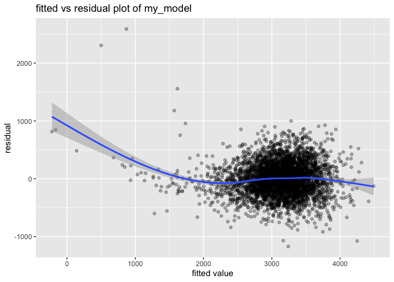
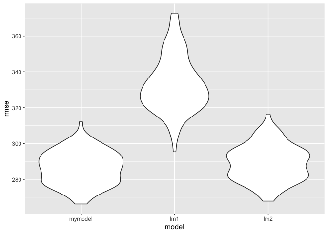
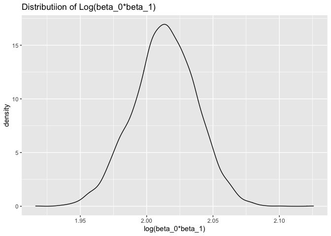
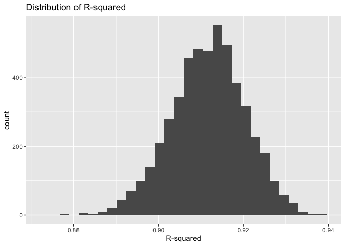

HW6 by Ximeng
================

# Problem 1

## Problem 1

``` r
homicide_df = 
  read_csv("./data/homicide-data.csv") %>% 
  mutate(
    city_state = str_c(city, state, sep = ","),
    victim_age = as.numeric(victim_age),
    resolution = case_when(
      disposition == "Closed without arrest" ~ 0,
      disposition == "Open/No arrest"        ~ 0,
      disposition == "Closed by arrest"      ~ 1,
    )
  ) %>% 
  filter(city_state != "Tulsa_AL") %>%
  filter(victim_race %in% c("White", "Black")) %>% 
  select(city_state, resolution, victim_age, victim_race, victim_sex)
```

    ## Parsed with column specification:
    ## cols(
    ##   uid = col_character(),
    ##   reported_date = col_double(),
    ##   victim_last = col_character(),
    ##   victim_first = col_character(),
    ##   victim_race = col_character(),
    ##   victim_age = col_character(),
    ##   victim_sex = col_character(),
    ##   city = col_character(),
    ##   state = col_character(),
    ##   lat = col_double(),
    ##   lon = col_double(),
    ##   disposition = col_character()
    ## )

    ## Warning: Problem with `mutate()` input `victim_age`.
    ## ℹ NAs introduced by coercion
    ## ℹ Input `victim_age` is `as.numeric(victim_age)`.

    ## Warning in mask$eval_all_mutate(dots[[i]]): NAs introduced by coercion

Start with one city

``` r
baltimore_df = 
  homicide_df %>% 
  filter(city_state == "Baltimore,MD")

glm(resolution ~ victim_age + victim_race + victim_sex,
    data = baltimore_df,
    family = binomial()) %>% 
  broom::tidy() %>% 
  mutate(
    OR = exp(estimate),
    CI_lower = exp(estimate - 1.96 * std.error),
    CI_upper = exp(estimate + 1.96 * std.error)
  ) %>% 
  select(term, OR, starts_with("CI")) %>% 
  knitr::kable(digit = 3)
```

| term              |    OR | CI\_lower | CI\_upper |
| :---------------- | ----: | --------: | --------: |
| (Intercept)       | 1.363 |     0.975 |     1.907 |
| victim\_age       | 0.993 |     0.987 |     1.000 |
| victim\_raceWhite | 2.320 |     1.648 |     3.268 |
| victim\_sexMale   | 0.426 |     0.325 |     0.558 |

# Problem 2

``` r
bwt_df = read_csv("data/birthweight.csv") %>%
  mutate(babysex = as.factor(
    case_when(
      babysex == 2 ~ "female",
      babysex == 1 ~ "male")),
    frace = as.factor(frace),
    mrace = as.factor(mrace)
  ) %>%
  select(babysex, bhead, blength, bwt, delwt, gaweeks, menarche)
```

    ## Parsed with column specification:
    ## cols(
    ##   .default = col_double()
    ## )

    ## See spec(...) for full column specifications.

``` r
# the  first model I proposed is a multiple linear model with 5 predictors including one interaction term
my_model_raw = lm(bwt ~ bhead + blength + delwt + menarche + bhead*blength , data = bwt_df) 

# tidy the output 
my_model_raw %>% 
  broom::tidy() %>% 
  select(term, estimate, p.value) %>% 
  knitr::kable(digits = 3)
```

| term          |   estimate | p.value |
| :------------ | ---------: | ------: |
| (Intercept)   | \-4268.992 |   0.000 |
| bhead         |     88.285 |   0.000 |
| blength       |     44.883 |   0.008 |
| delwt         |      2.056 |   0.000 |
| menarche      |    \-2.052 |   0.486 |
| bhead:blength |      1.137 |   0.025 |

``` r
# take out not significant term and improve the model
my_model = lm(bwt ~ bhead + blength + delwt , data = bwt_df)

# tidy the output 
my_model %>% 
  broom::tidy() %>% 
  select(term, estimate, p.value) %>% 
  knitr::kable(digits = 3)
```

| term        |   estimate | p.value |
| :---------- | ---------: | ------: |
| (Intercept) | \-6089.845 |       0 |
| bhead       |    142.694 |       0 |
| blength     |     82.368 |       0 |
| delwt       |      2.092 |       0 |

``` r
bwt_df %>%                            #residual vs fitted plot
  modelr::add_predictions(my_model) %>%
  modelr::add_residuals(my_model) %>%
  ggplot(aes(x = pred, y = resid)) + geom_point(alpha = 0.3) + geom_smooth() +
  labs(title = "fitted vs residual plot of my_model", x = "fitted value", y = "residual")
```

    ## `geom_smooth()` using method = 'gam' and formula 'y ~ s(x, bs = "cs")'

<!-- -->

``` r
lm_1 = lm(bwt ~ blength + gaweeks, data = bwt_df)

lm_2 = lm(bwt ~ bhead + blength + babysex + bhead*blength + bhead*babysex + blength*babysex + bhead*blength*babysex, data = bwt_df)
```

The first model I choose in the beginning has 5 predictors including one
interaction term between `bhead` and `blength`. There are two terms that
weren’t significant, so I took out those two factors, and the model is
improved. The final model I chose has three predictors: `bhead`,
`blength`, `delwt`

Cross validation

``` r
cv_df =        # create 100 paired of train and test for cross validation
  crossv_mc(bwt_df,100)

cv_df =
  cv_df %>%   
  mutate(
    train = map(train, as_tibble),
    test = map(test, as_tibble))

cv_df = 
  cv_df %>%
  mutate(
    my_model = map(train, ~lm(bwt ~ bhead + blength + delwt, data = .x)),
    lm_1 = map(train, ~lm(bwt ~  blength + gaweeks, data = .x)),
    lm_2 = map(train, ~lm(bwt ~ bhead + blength + babysex + bhead*blength + bhead*babysex + blength*babysex + bhead*blength*babysex, data = .x))    # map linear model with train data
  ) %>%
  mutate(
    rmse_mymodel = map2_dbl(my_model, test, ~rmse(model = .x, data = .y)),  # map linear model with test data, and give
    rmse_lm1 = map2_dbl(lm_1, test, ~rmse(model = .x, data = .y)),          # result of rmse
    rmse_lm2 = map2_dbl(lm_2, test, ~rmse(model = .x, data = .y)))

cv_df %>% 
  select(starts_with("rmse")) %>% 
  pivot_longer(
    everything(),            #combine 3 rmse and create 3 violin plot to compare
    names_to = "model", 
    values_to = "rmse",
    names_prefix = "rmse_") %>% 
  mutate(model = fct_inorder(model)) %>% 
  ggplot(aes(x = model, y = rmse)) + geom_violin()
```

<!-- --> In
terms of the rmse from cross validation, `my_model` may be a better
choice since its rmse is remarkbly smaller than `lm1` and slightly
smaller than `lm2`. However, when choosing between `my_model` and `lm2`,
their r-squared is similarly and `my_model` is more simple because it
doesn’t have interaction terms. I will choose `my_model`

# Problem 3

Import data

``` r
weather_df = 
  rnoaa::meteo_pull_monitors(
    c("USW00094728"),
    var = c("PRCP", "TMIN", "TMAX"), 
    date_min = "2017-01-01",
    date_max = "2017-12-31") %>%
  mutate(
    name = recode(id, USW00094728 = "CentralPark_NY"),
    tmin = tmin / 10,
    tmax = tmax / 10) %>%
  select(name, id, everything())
```

    ## Registered S3 method overwritten by 'hoardr':
    ##   method           from
    ##   print.cache_info httr

    ## using cached file: /Users/ximengz/Library/Caches/R/noaa_ghcnd/USW00094728.dly

    ## date created (size, mb): 2020-12-08 23:35:51 (7.536)

    ## file min/max dates: 1869-01-01 / 2020-12-31

Bootstrap

``` r
lm(tmax ~ tmin, data = weather_df) %>% #the linear model of interest
  broom::tidy() %>% 
  knitr::kable(digits = 3)  
```

| term        | estimate | std.error | statistic | p.value |
| :---------- | -------: | --------: | --------: | ------: |
| (Intercept) |    7.209 |     0.226 |    31.847 |       0 |
| tmin        |    1.039 |     0.017 |    61.161 |       0 |

``` r
boot_sample = function(df) {           #create function that can generate bootstrap sample with input of a dataframe
  sample_frac(df, replace = TRUE)
}

boot_strap =                           # create a data frame of the 5000 boot sample with id number
  data_frame(
    strap_number = 1:5000,
    strap_sample = rerun(5000, boot_sample(weather_df))
  )
```

    ## Warning: `data_frame()` is deprecated as of tibble 1.1.0.
    ## Please use `tibble()` instead.
    ## This warning is displayed once every 8 hours.
    ## Call `lifecycle::last_warnings()` to see where this warning was generated.

``` r
bootstrap_result =                  #create a data from that map the 5000 sample with its linear model
  boot_strap %>%
  mutate(
    models = map(strap_sample, ~lm(tmax ~ tmin, data = .x)))
```

Get log(beta\_0\*beta\_1)

``` r
# create a function that can generate the value of log(beta_0*beta_1) with the input of a dataframe
log_beta = function(df){         
  
fit = lm(tmax ~ tmin, data = df)    # firstly generate a linear model with the input datafram

est =                       # secondly create a data frame with the broomed result of linear model
fit %>%
broom::tidy() %>% 
select(term, estimate) %>%        # select parameter of interest
mutate(term = str_replace(term,"\\(Intercept\\)","Intercept")) %>%   # omit the "()"
pivot_wider(                     #pivot wider so the beta_0 and beta_1 can be separated
names_from = "term",
values_from = "estimate"
)

est = 
tibble(        # the output is est dataframe with log(beta_0*beta_1) in it
est,
log = log(pull(est, Intercept) * pull(est, tmin)))

est
}

#rerun the function for 5000 times, each time the dataframe input is a bootstrap sample generate from the weather_df
logbeta_df = rerun(5000, log_beta(boot_sample(weather_df))) %>% 
  bind_rows()

#summarize the mean and CI for log(beta_0*beta_1)
logbeta_df %>%
  summarize(mean = mean(log),
            lower = quantile(log, c(0.025)),
            upper = quantile(log, c(0.975))) %>%
  knitr::kable()
```

|     mean |    lower |    upper |
| -------: | -------: | -------: |
| 2.013505 | 1.966022 | 2.059594 |

``` r
#plot log(beta0*beta1)
logbeta_df %>%
  ggplot(aes(x = log)) + geom_density() + labs(title = "Distributiion of Log(beta_0*beta_1)", x = "log(beta_0*beta_1)", y = "density")
```

<!-- --> The
distribution of `log(beta_o*beta_1)` follows a normal distribution, with
mean around 2.01. The 95% CI for `log(beta_o*beta_1)` is (1.96, 2.06)

get R-squared

``` r
r_squared = bootstrap_result %>%  #using the dataframe with 5000 linear model generated from bootstrap sample
  mutate(
    result2 = map(models, broom::glance)   # to get r-squared
  ) %>%
  select(-strap_sample, -models) %>%    #select parameter of interest
  unnest(result2) %>%
  janitor::clean_names()

# plot R squared
r_squared %>%
  ggplot(aes(x = r_squared)) + geom_histogram() + labs(title = "Distribution of R-squared", x = "R-squared")
```

    ## `stat_bin()` using `bins = 30`. Pick better value with `binwidth`.

<!-- -->

``` r
# get mean and CI of R-squared
r_squared %>%
  summarize(mean = mean(r_squared),
            lower = quantile(r_squared, c(0.025)),
            upper = quantile(r_squared, c(0.975))) %>%
  knitr::kable()
```

|      mean |     lower |     upper |
| --------: | --------: | --------: |
| 0.9116257 | 0.8937898 | 0.9278018 |

`R-squared` also follows a normal distribution with mean around 0.911.
The 95% CI is (0.894, 0.927)
